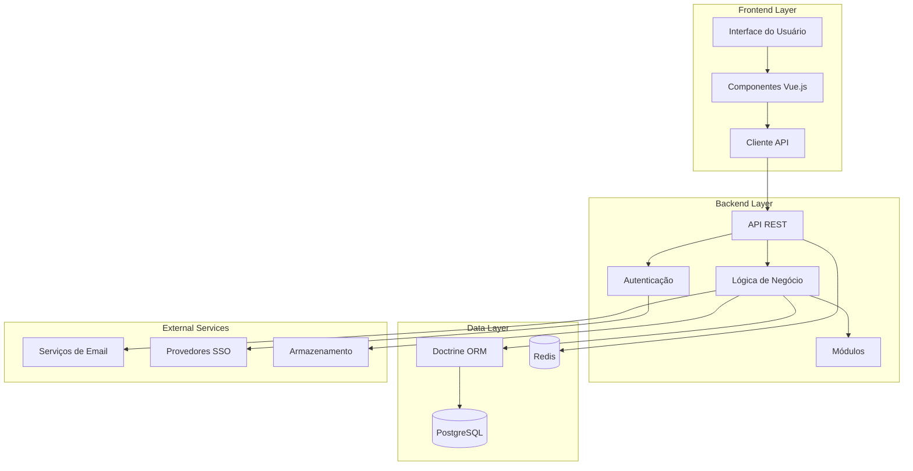
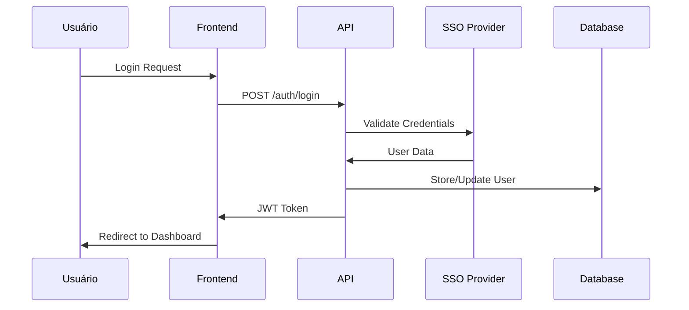
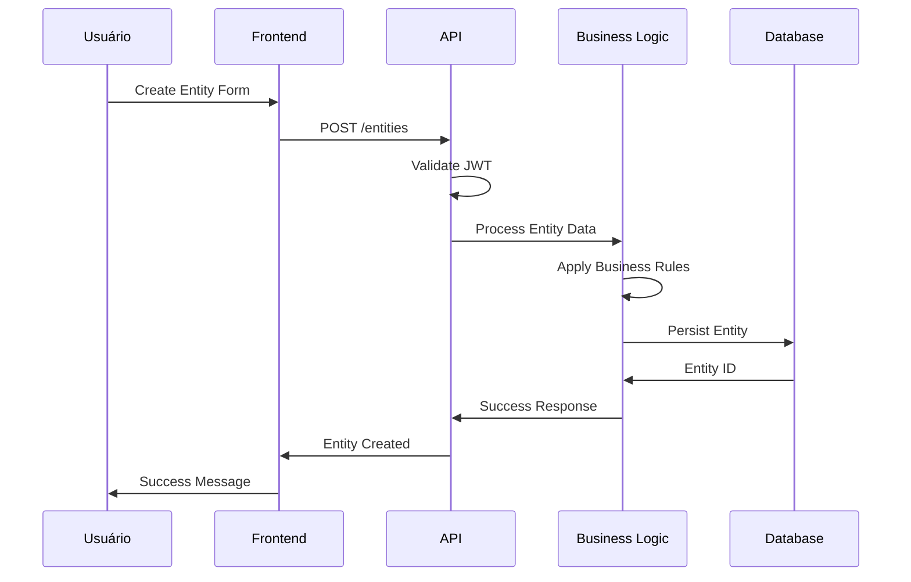
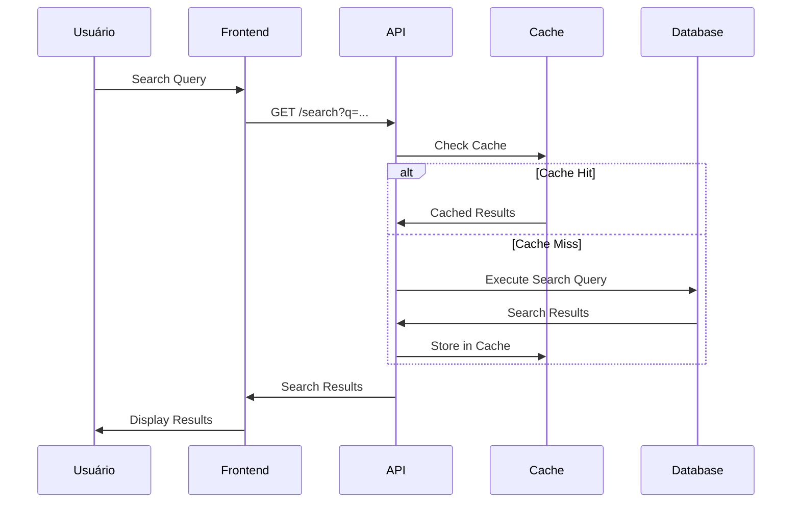

# Arquitetura do Sistema

A arquitetura do Mapas Culturais segue os princípios de **separação de responsabilidades**, **modularidade** e **escalabilidade**, permitindo um desenvolvimento sustentável e manutenção eficiente da plataforma.

## Visão Geral da Arquitetura

## Camadas da Arquitetura

### 1. Camada de Apresentação (Frontend)

**Tecnologias**: Vue.js, Webpack, Sass, JavaScript ES6+

#### Componentes Principais:
- **Interface do Usuário**: Templates HTML com componentes Vue reativos
- **Gerenciamento de Estado**: Estado local dos componentes e comunicação via props/events
- **Roteamento**: Navegação SPA (Single Page Application)
- **Build System**: Webpack com Laravel Mix para otimização de assets

#### Responsabilidades:
- Renderização da interface de usuário
- Validação de formulários no cliente
- Comunicação com a API backend
- Gerenciamento de sessão do usuário

### 2. Camada de API (Backend)

**Tecnologias**: PHP, Slim Framework, JWT

#### Componentes Principais:
- **Controladores REST**: Endpoints para operações CRUD
- **Middleware**: Autenticação, autorização, logging, CORS
- **Roteamento**: Definição de rotas da API
- **Serialização**: Transformação de dados para JSON

#### Responsabilidades:
- Exposição de APIs RESTful
- Autenticação e autorização
- Validação de dados de entrada
- Orquestração da lógica de negócio

### 3. Camada de Negócio

**Tecnologias**: PHP, Doctrine ORM

#### Componentes Principais:
- **Entidades**: Modelos de domínio (Agent, Space, Event, Project, Opportunity)
- **Serviços**: Lógica de negócio complexa
- **Repositórios**: Acesso a dados abstraído
- **Eventos**: Sistema de eventos para desacoplamento

#### Responsabilidades:
- Implementação das regras de negócio
- Validação de dados de domínio
- Coordenação entre diferentes módulos
- Processamento de workflows complexos

### 4. Camada de Dados

**Tecnologias**: PostgreSQL, Redis, Doctrine ORM

#### Componentes Principais:
- **ORM**: Mapeamento objeto-relacional com Doctrine
- **Banco Principal**: PostgreSQL com extensões geoespaciais
- **Cache**: Redis para sessões e cache de dados
- **Migrações**: Versionamento do schema do banco

#### Responsabilidades:
- Persistência de dados
- Consultas otimizadas
- Cache de dados frequentemente acessados
- Backup e recuperação

## Fluxos de Dados Principais

### 1. Fluxo de Autenticação

### 2. Fluxo de Criação de Entidade

### 3. Fluxo de Busca

## Módulos e Plugins

### Arquitetura Modular

A plataforma utiliza uma arquitetura modular que permite:

- **Extensibilidade**: Novos módulos podem ser adicionados sem modificar o core
- **Reutilização**: Módulos podem ser reutilizados em diferentes contextos
- **Manutenibilidade**: Cada módulo tem responsabilidades bem definidas
- **Testabilidade**: Módulos podem ser testados independentemente

### Principais Módulos

#### Core Modules
- **Entities**: Gerenciamento das entidades principais
- **Authentication**: Sistema de autenticação múltipla
- **Search**: Motor de busca e indexação
- **Notifications**: Sistema de notificações

#### Feature Modules
- **Opportunities**: Gestão de editais e oportunidades
- **Evaluations**: Métodos de avaliação
- **Reports**: Geração de relatórios
- **Themes**: Personalização visual

#### Integration Modules
- **LGPD**: Conformidade com proteção de dados
- **Spreadsheets**: Import/export de dados
- **Geolocation**: Funcionalidades geoespaciais

## Padrões Arquiteturais

### 1. Repository Pattern
- Abstração do acesso a dados
- Facilita testes unitários
- Permite troca de implementação de persistência

### 2. Service Layer
- Encapsula lógica de negócio complexa
- Promove reutilização de código
- Facilita manutenção e evolução

### 3. Event-Driven Architecture
- Desacoplamento entre módulos
- Extensibilidade via listeners
- Auditoria e logging automáticos

### 4. API-First Design
- Frontend e backend independentes
- Facilita integrações externas
- Permite múltiplos clientes

## Considerações de Performance

### Otimizações Implementadas

#### Backend
- **Query Optimization**: Consultas otimizadas com índices apropriados
- **Lazy Loading**: Carregamento sob demanda de relacionamentos
- **Connection Pooling**: Pool de conexões com banco de dados
- **Response Caching**: Cache de respostas da API

#### Frontend
- **Code Splitting**: Divisão do código em chunks menores
- **Asset Optimization**: Minificação e compressão de assets
- **Lazy Loading**: Carregamento sob demanda de componentes
- **Service Workers**: Cache offline de recursos

#### Infraestrutura
- **Database Indexing**: Índices otimizados para consultas frequentes
- **Redis Caching**: Cache distribuído para dados frequentes
- **CDN**: Distribuição de assets estáticos
- **Load Balancing**: Distribuição de carga entre servidores

## Segurança

### Medidas de Segurança Implementadas

- **JWT Authentication**: Tokens seguros para autenticação
- **HTTPS Enforcement**: Comunicação criptografada
- **Input Validation**: Validação rigorosa de entrada
- **SQL Injection Prevention**: Uso de prepared statements
- **XSS Protection**: Sanitização de dados de saída
- **CSRF Protection**: Tokens CSRF para formulários
- **Rate Limiting**: Limitação de requisições por IP

## Próximos Passos

Para aprofundar o conhecimento sobre a implementação:

1. **[Entidades](../01_entidades__entities__)** - Modelos de dados detalhados
2. **[Componentes Vue](../02_componentes_vue__vue_components__)** - Implementação do frontend
3. **[Classe API](../03_classe_api_)** - Comunicação entre camadas

---

*Esta arquitetura foi projetada para suportar o crescimento da plataforma mantendo qualidade e performance.*
