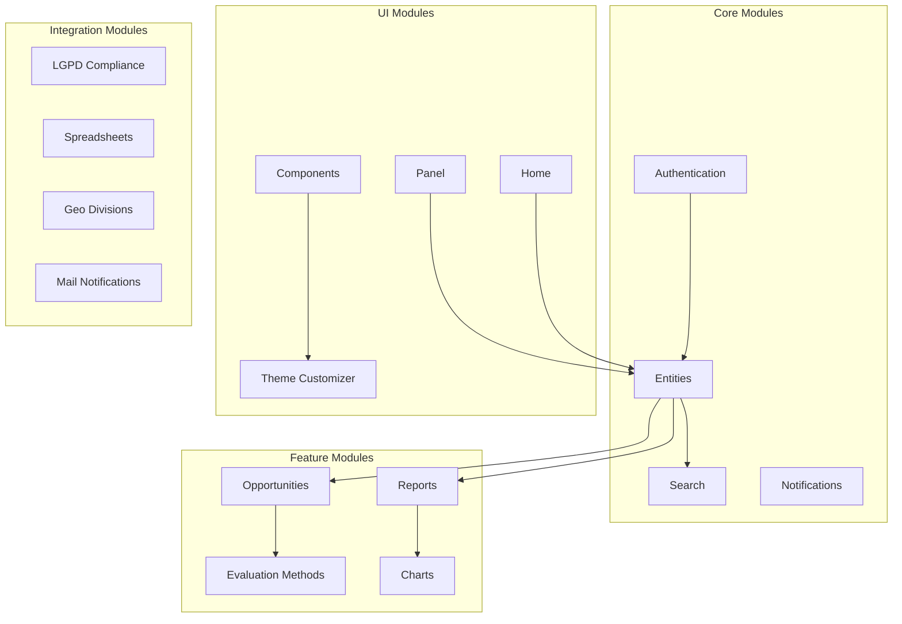

# Módulos e Funcionalidades Essenciais

A arquitetura modular do Mapas Culturais, evidente no diretório `src/modules`, permite uma plataforma flexível e extensível. Cada módulo geralmente encapsula um conjunto específico de funcionalidades, contribuindo para os recursos gerais do sistema.

## Visão Geral da Arquitetura Modular

## Módulos Principais

### 1. Gestão de Usuários e Contas

#### UserManagement
**Funcionalidade**: Gerenciamento completo do ciclo de vida dos usuários
- Registro e ativação de contas
- Perfis de usuário personalizáveis
- Gestão de permissões e papéis
- Histórico de atividades

**Implicação de Negócios**: Permite controle granular sobre quem pode acessar e modificar informações na plataforma, essencial para governança de dados culturais.

#### DeleteAccount
**Funcionalidade**: Conformidade com direito ao esquecimento
- Exclusão completa de dados pessoais
- Anonização de contribuições históricas
- Processo de confirmação seguro
- Logs de auditoria

**Implicação de Negócios**: Garante conformidade com LGPD e outras regulamentações de privacidade, reduzindo riscos legais.

#### FakeAuthentication
**Funcionalidade**: Sistema de autenticação para desenvolvimento e testes
- Simulação de diferentes tipos de usuário
- Testes automatizados de autorização
- Ambiente de desenvolvimento isolado
- Integração com CI/CD

**Implicação de Negócios**: Acelera o desenvolvimento e garante qualidade através de testes automatizados.

### 2. Gestão de Conteúdo e Entidades

#### Entities
**Funcionalidade**: Modelos de dados centrais da plataforma
- Agentes (pessoas físicas e jurídicas)
- Espaços (locais culturais)
- Eventos (atividades culturais)
- Projetos (iniciativas de médio/longo prazo)
- Relacionamentos entre entidades

**Implicação de Negócios**: Fornece a base estrutural para toda informação cultural, permitindo análises complexas e relatórios estratégicos.

#### Apps
**Funcionalidade**: Aplicações específicas construídas sobre as entidades
- Interfaces especializadas por tipo de usuário
- Fluxos de trabalho customizados
- Integrações com sistemas externos
- Dashboards personalizados

**Implicação de Negócios**: Permite adaptação da plataforma para diferentes contextos de uso sem modificar o core.

#### Home
**Funcionalidade**: Gestão da experiência inicial do usuário
- Página inicial personalizável
- Destaques e notícias
- Onboarding de novos usuários
- Métricas de engajamento

**Implicação de Negócios**: Melhora a adoção da plataforma e engajamento dos usuários através de uma primeira impressão positiva.

### 3. Gestão de Oportunidades e Projetos

#### Opportunities
**Funcionalidade**: Sistema completo de editais e chamadas públicas
- Criação e configuração de oportunidades
- Formulários dinâmicos de inscrição
- Gestão de prazos e fases
- Comunicação com proponentes

**Implicação de Negócios**: Digitaliza e otimiza processos de fomento cultural, reduzindo custos administrativos e aumentando transparência.

#### OpportunityPhases
**Funcionalidade**: Gestão de fases dos processos seletivos
- Definição de etapas sequenciais
- Critérios específicos por fase
- Transições automáticas e manuais
- Notificações de mudança de fase

**Implicação de Negócios**: Permite processos seletivos complexos e transparentes, adequados a diferentes tipos de fomento cultural.

#### OpportunityAccountability
**Funcionalidade**: Prestação de contas de projetos aprovados
- Relatórios de execução
- Comprovação de gastos
- Acompanhamento de metas
- Avaliação de resultados

**Implicação de Negócios**: Garante o uso adequado de recursos públicos e fornece dados para avaliação de políticas culturais.

#### OpportunityAppealPhase
**Funcionalidade**: Sistema de recursos e contestações
- Processo formal de recurso
- Análise por comissão especializada
- Prazos e procedimentos definidos
- Transparência nas decisões

**Implicação de Negócios**: Assegura devido processo legal e reduz questionamentos judiciais sobre processos seletivos.

#### OpportunityWorkplan
**Funcionalidade**: Gestão de planos de trabalho
- Cronogramas detalhados
- Marcos e entregas
- Acompanhamento de progresso
- Ajustes e reprogramações

**Implicação de Negócios**: Melhora a execução de projetos culturais e facilita o monitoramento de resultados.

#### ProjectMonitoring
**Funcionalidade**: Monitoramento contínuo de projetos
- Indicadores de performance
- Alertas de desvios
- Relatórios automáticos
- Dashboard executivo

**Implicação de Negócios**: Permite intervenções proativas e melhora a taxa de sucesso dos projetos financiados.

### 4. Processos de Avaliação e Seleção

#### EvaluationMethodContinuous
**Funcionalidade**: Avaliação contínua de projetos
- Fluxo contínuo de inscrições
- Avaliação por ordem de chegada
- Critérios de elegibilidade automáticos
- Aprovação imediata quando possível

**Implicação de Negócios**: Adequado para programas de fomento com recursos contínuos, reduzindo tempo de espera dos proponentes.

#### EvaluationMethodDocumentary
**Funcionalidade**: Avaliação baseada em análise documental
- Checklist de documentos obrigatórios
- Validação automática de formatos
- Análise de conformidade
- Pontuação por critérios documentais

**Implicação de Negócios**: Eficiente para processos que dependem principalmente de comprovação documental.

#### EvaluationMethodQualification
**Funcionalidade**: Avaliação por qualificação técnica
- Análise de currículo e portfólio
- Critérios de experiência
- Pontuação por competências
- Ranking de qualificação

**Implicação de Negócios**: Adequado para seleção de profissionais e projetos que exigem expertise específica.

#### EvaluationMethodSimple
**Funcionalidade**: Avaliação simplificada
- Critérios básicos de elegibilidade
- Processo rápido de aprovação
- Mínima burocracia
- Foco na democratização do acesso

**Implicação de Negócios**: Facilita o acesso a recursos para pequenos projetos e iniciativas comunitárias.

#### EvaluationMethodTechnical
**Funcionalidade**: Avaliação técnica especializada
- Comissões de especialistas
- Critérios técnicos complexos
- Análise detalhada de propostas
- Pareceres fundamentados

**Implicação de Negócios**: Garante qualidade técnica em projetos de maior complexidade e valor.

### 5. Relatórios e Análise de Dados

#### Reports
**Funcionalidade**: Sistema de relatórios customizáveis
- Relatórios pré-definidos
- Construtor de relatórios personalizado
- Exportação em múltiplos formatos
- Agendamento automático

**Implicação de Negócios**: Fornece insights estratégicos para tomada de decisão e prestação de contas.

#### Charts
**Funcionalidade**: Visualizações gráficas de dados
- Gráficos interativos
- Dashboards executivos
- Indicadores em tempo real
- Comparações históricas

**Implicação de Negócios**: Facilita a compreensão de dados complexos e melhora a comunicação de resultados.

#### Spreadsheets
**Funcionalidade**: Importação e exportação de dados
- Import/export Excel e CSV
- Validação de dados importados
- Templates padronizados
- Processamento em lote

**Implicação de Negócios**: Facilita migração de dados e integração com sistemas legados.

#### ApiKeywords
**Funcionalidade**: Gestão de palavras-chave para busca
- Indexação inteligente
- Sinônimos e termos relacionados
- Otimização de busca
- Analytics de termos

**Implicação de Negócios**: Melhora a descoberta de conteúdo e experiência do usuário.

#### Search
**Funcionalidade**: Motor de busca avançado
- Busca textual e geográfica
- Filtros múltiplos
- Busca facetada
- API de busca

**Implicação de Negócios**: Essencial para descoberta de informações culturais e usabilidade da plataforma.

### 6. Comunicação e Notificações

#### MailNotification
**Funcionalidade**: Sistema de notificações por e-mail
- Templates personalizáveis
- Envio em lote
- Tracking de entrega
- Integração com provedores

**Implicação de Negócios**: Mantém usuários engajados e informados sobre oportunidades e atualizações.

#### Notifications
**Funcionalidade**: Sistema de notificações da plataforma
- Notificações em tempo real
- Preferências de usuário
- Histórico de notificações
- Integração com dispositivos móveis

**Implicação de Negócios**: Melhora a experiência do usuário e garante que informações importantes sejam comunicadas.

### 7. Personalização e Interface

#### ThemeCustomizer
**Funcionalidade**: Personalização visual da plataforma
- Editor visual de temas
- Customização de cores e fontes
- Upload de logotipos
- Preview em tempo real

**Implicação de Negócios**: Permite que cada instituição mantenha sua identidade visual, aumentando adoção e reconhecimento.

#### Components
**Funcionalidade**: Biblioteca de componentes reutilizáveis
- Componentes Vue.js padronizados
- Design system consistente
- Documentação de componentes
- Testes automatizados

**Implicação de Negócios**: Acelera desenvolvimento e garante consistência visual em toda a plataforma.

### 8. Recursos Especializados

#### GeoDivisions
**Funcionalidade**: Gestão de divisões geográficas
- Hierarquia territorial
- Mapas interativos
- Análise geoespacial
- Integração com dados oficiais

**Implicação de Negócios**: Permite análises territoriais da cultura e planejamento baseado em localização.

#### LGPD
**Funcionalidade**: Conformidade com Lei Geral de Proteção de Dados
- Gestão de consentimentos
- Relatórios de conformidade
- Anonização de dados
- Auditoria de privacidade

**Implicação de Negócios**: Reduz riscos legais e demonstra compromisso com privacidade dos usuários.

#### Support
**Funcionalidade**: Sistema de suporte ao usuário
- Central de ajuda
- Tickets de suporte
- Base de conhecimento
- Chat integrado

**Implicação de Negócios**: Reduz custos de suporte e melhora satisfação dos usuários.

#### FAQ
**Funcionalidade**: Perguntas frequentes dinâmicas
- FAQ categorizado
- Busca em perguntas
- Analytics de dúvidas
- Atualização colaborativa

**Implicação de Negócios**: Reduz volume de suporte e melhora autonomia dos usuários.

## Benefícios da Arquitetura Modular

### Flexibilidade
- **Ativação seletiva** de módulos conforme necessidade
- **Customização** sem impacto no core
- **Evolução independente** de funcionalidades
- **Adaptação** a contextos específicos

### Manutenibilidade
- **Responsabilidades bem definidas** por módulo
- **Testes isolados** e específicos
- **Atualizações seguras** sem quebrar funcionalidades
- **Debugging facilitado**

### Escalabilidade
- **Distribuição de carga** por funcionalidade
- **Otimização específica** por módulo
- **Cache granular** por tipo de dados
- **Performance otimizada**

### Extensibilidade
- **Novos módulos** sem modificar existentes
- **APIs padronizadas** para integração
- **Hooks e eventos** para customização
- **Ecossistema de plugins**

## Próximos Passos

Para aprofundar o conhecimento sobre implementação:

1. **[Personalização e Configuração](05_personalizacao_configuracao)** - Opções de customização
2. **[Entidades](../01_entidades__entities__)** - Modelos de dados detalhados
3. **[Componentes Vue](../02_componentes_vue__vue_components__)** - Interface de usuário

---

*A arquitetura modular é fundamental para a flexibilidade e sustentabilidade da plataforma Mapas Culturais.*
