# Personalização e Configuração

A capacidade de personalizar a interface do usuário (UI) e o comportamento da plataforma Mapas Culturais é crucial para atender às necessidades específicas de diferentes instituições e contextos culturais. Essas configurações permitem que as instâncias da plataforma se adaptem à identidade visual, aos fluxos de trabalho e aos requisitos de conteúdo de cada implementação.

## Visão Geral da Personalização

```mermaid
graph TB
    subgraph "Visual Customization"
        BRANDING[Branding & Logos]
        THEMES[Colors & Themes]
        LAYOUT[Layout & Structure]
    end
    
    subgraph "Content Customization"
        FIELDS[Custom Fields]
        ENTITIES[Entity Types]
        TAXONOMIES[Taxonomies]
    end
    
    subgraph "Workflow Customization"
        PROCESSES[Registration Processes]
        EVALUATIONS[Evaluation Flows]
        NOTIFICATIONS[Notification Templates]
    end
    
    subgraph "Integration Customization"
        SSO[Authentication Providers]
        APIS[External APIs]
        LOCALIZATION[Language & Region]
    end
    
    BRANDING --> THEMES
    THEMES --> LAYOUT
    FIELDS --> ENTITIES
    ENTITIES --> TAXONOMIES
    PROCESSES --> EVALUATIONS
    EVALUATIONS --> NOTIFICATIONS
    SSO --> APIS
    APIS --> LOCALIZATION
```



## Tipos de Configurações de Personalização

### 1. Branding e Aparência Visual

#### Logotipos e Identidade Visual
**Funcionalidades disponíveis:**
- Upload de logotipos personalizados (principal, secundário, favicon)
- Configuração de ícones para diferentes seções
- Imagens de fundo e banners customizáveis
- Watermarks e elementos de marca

**Configuração técnica:**
```php
// Exemplo de configuração de logo
'app.logo' => [
    'main' => '/uploads/logos/main-logo.png',
    'secondary' => '/uploads/logos/secondary-logo.png',
    'favicon' => '/uploads/logos/favicon.ico'
]
```

**Implicação de Negócios:** Permite que cada instituição mantenha sua identidade visual consistente, aumentando reconhecimento e credibilidade.

#### Esquemas de Cores e Temas
**Funcionalidades disponíveis:**
- Definição de cores primárias e secundárias
- Paleta de cores personalizada
- Temas claro e escuro
- Customização de CSS avançada

**Configuração técnica:**
```scss
// Variáveis de tema personalizadas
$primary-color: #2c5aa0;
$secondary-color: #f39c12;
$accent-color: #e74c3c;
$background-color: #ffffff;
$text-color: #333333;
```

**Implicação de Negócios:** Alinha a plataforma com guidelines de marca institucional e melhora experiência do usuário.

#### Layout e Estrutura
**Funcionalidades disponíveis:**
- Configuração de cabeçalhos e rodapés
- Personalização de menus de navegação
- Ajustes de layout responsivo
- Configuração de sidebars e widgets

**Implicação de Negócios:** Otimiza a experiência do usuário para diferentes contextos de uso e dispositivos.

### 2. Conteúdo e Apresentação

#### Campos Personalizados e Metadados
**Funcionalidades disponíveis:**
- Criação de campos específicos por tipo de entidade
- Validação customizada de dados
- Campos obrigatórios e opcionais
- Diferentes tipos de input (texto, número, data, arquivo, etc.)

**Configuração técnica:**
```php
// Exemplo de campo personalizado
'custom_fields' => [
    'agent' => [
        'specialty' => [
            'type' => 'select',
            'label' => 'Especialidade Artística',
            'options' => ['musica', 'teatro', 'danca', 'artes_visuais'],
            'required' => true
        ]
    ]
]
```

**Implicação de Negócios:** Permite coleta de informações específicas para cada contexto cultural, melhorando qualidade dos dados.

#### Tipos de Entidades e Taxonomias
**Funcionalidades disponíveis:**
- Definição de novos tipos de entidades
- Criação de taxonomias personalizadas
- Categorização hierárquica
- Tags e palavras-chave específicas

**Configuração técnica:**
```php
// Exemplo de taxonomia personalizada
'taxonomies' => [
    'linguagem_artistica' => [
        'label' => 'Linguagem Artística',
        'hierarchical' => true,
        'entities' => ['agent', 'project', 'event']
    ]
]
```

**Implicação de Negócios:** Organiza informações de forma relevante para cada contexto cultural e facilita busca e análise.

#### Páginas Iniciais Personalizáveis
**Funcionalidades disponíveis:**
- Editor de conteúdo da página inicial
- Widgets configuráveis
- Destaques e notícias
- Chamadas para ação personalizadas

**Implicação de Negócios:** Melhora primeira impressão e engajamento dos usuários.

### 3. Fluxos de Trabalho e Processos

#### Processos de Inscrição e Avaliação
**Funcionalidades disponíveis:**
- Configuração de etapas de inscrição
- Formulários dinâmicos personalizáveis
- Fluxos de aprovação customizados
- Critérios de avaliação específicos

**Configuração técnica:**
```php
// Exemplo de configuração de processo
'opportunity_phases' => [
    'inscricao' => [
        'label' => 'Inscrição',
        'duration' => 30, // dias
        'required_fields' => ['project_description', 'budget']
    ],
    'avaliacao' => [
        'label' => 'Avaliação',
        'evaluators' => 3,
        'criteria' => ['relevancia', 'viabilidade', 'impacto']
    ]
]
```

**Implicação de Negócios:** Adapta processos seletivos às especificidades de cada programa de fomento cultural.

#### Notificações e Alertas
**Funcionalidades disponíveis:**
- Templates de e-mail personalizáveis
- Configuração de gatilhos automáticos
- Preferências de usuário
- Integração com sistemas externos

**Configuração técnica:**
```php
// Exemplo de template de notificação
'notification_templates' => [
    'opportunity_published' => [
        'subject' => 'Nova oportunidade: {{opportunity.name}}',
        'body' => 'templates/emails/opportunity-published.html',
        'triggers' => ['opportunity.publish']
    ]
]
```

**Implicação de Negócios:** Mantém usuários informados e engajados com comunicação relevante e oportuna.

#### Permissões e Papéis de Usuário
**Funcionalidades disponíveis:**
- Definição de papéis customizados
- Permissões granulares por funcionalidade
- Hierarquia de acesso
- Delegação de responsabilidades

**Configuração técnica:**
```php
// Exemplo de configuração de papéis
'user_roles' => [
    'gestor_cultural' => [
        'label' => 'Gestor Cultural',
        'permissions' => [
            'opportunity.create',
            'opportunity.manage',
            'evaluation.participate'
        ]
    ]
]
```

**Implicação de Negócios:** Garante segurança e controle adequado sobre informações sensíveis.

### 4. Funcionalidades de Pesquisa e Filtragem

#### Filtros Personalizados
**Funcionalidades disponíveis:**
- Configuração de filtros por categoria
- Filtros geográficos customizados
- Filtros por campos personalizados
- Salvamento de buscas favoritas

**Configuração técnica:**
```php
// Exemplo de configuração de filtros
'search_filters' => [
    'linguagem_artistica' => [
        'type' => 'taxonomy',
        'label' => 'Linguagem Artística',
        'multiple' => true
    ],
    'orcamento' => [
        'type' => 'range',
        'label' => 'Faixa de Orçamento',
        'min' => 0,
        'max' => 1000000
    ]
]
```

**Implicação de Negócios:** Facilita descoberta de informações relevantes e melhora experiência do usuário.

#### Palavras-chave e Tags
**Funcionalidades disponíveis:**
- Gestão de vocabulário controlado
- Sinônimos e termos relacionados
- Auto-sugestão de tags
- Analytics de termos de busca

**Implicação de Negócios:** Melhora qualidade da busca e descoberta de conteúdo.

### 5. Integração e Localização

#### Integração com Sistemas Externos
**Funcionalidades disponíveis:**
- APIs para integração com sistemas legados
- Webhooks para sincronização de dados
- Conectores para plataformas de e-mail marketing
- Integração com ferramentas de análise

**Configuração técnica:**
```php
// Exemplo de configuração de API externa
'external_apis' => [
    'email_marketing' => [
        'provider' => 'mailchimp',
        'api_key' => env('MAILCHIMP_API_KEY'),
        'list_id' => env('MAILCHIMP_LIST_ID')
    ]
]
```

**Implicação de Negócios:** Permite aproveitamento de investimentos em sistemas existentes e melhora eficiência operacional.

#### Configurações de Idioma
**Funcionalidades disponíveis:**
- Suporte a múltiplos idiomas
- Tradução de interface e conteúdo
- Localização de formatos (data, moeda)
- Configuração regional específica

**Configuração técnica:**
```php
// Exemplo de configuração de localização
'localization' => [
    'default_locale' => 'pt_BR',
    'available_locales' => ['pt_BR', 'es_ES', 'en_US'],
    'date_format' => 'd/m/Y',
    'currency' => 'BRL'
]
```

**Implicação de Negócios:** Permite uso da plataforma em diferentes contextos linguísticos e culturais.

#### Configurações Regionais
**Funcionalidades disponíveis:**
- Adaptação a legislações locais
- Integração com bases de dados oficiais
- Configuração de divisões administrativas
- Adequação a práticas culturais locais

**Implicação de Negócios:** Garante conformidade legal e relevância cultural em diferentes regiões.

## Ferramentas de Personalização

### Theme Customizer
**Interface visual para:**
- Edição de cores e fontes em tempo real
- Preview de mudanças antes da aplicação
- Backup e restauração de configurações
- Exportação/importação de temas

### Configuration Manager
**Painel administrativo para:**
- Gestão centralizada de configurações
- Versionamento de configurações
- Aplicação de configurações em lote
- Auditoria de mudanças

### Field Builder
**Construtor visual para:**
- Criação de campos personalizados
- Configuração de validações
- Definição de relacionamentos
- Testes de campos antes da publicação

## Implicações de Negócios da Personalização

### Adoção e Relevância
- **Maior taxa de adoção** através de relevância específica
- **Redução de resistência** à mudança
- **Aumento do engajamento** dos usuários
- **Melhoria na satisfação** geral

### Eficiência Operacional
- **Otimização de processos** internos
- **Redução de trabalho manual** através de automação
- **Diminuição de erros** através de validações específicas
- **Melhoria na qualidade** dos dados coletados

### Consistência da Marca
- **Reforço da identidade** institucional
- **Credibilidade aumentada** através de profissionalismo
- **Reconhecimento de marca** melhorado
- **Confiança do usuário** fortalecida

### Flexibilidade e Escalabilidade
- **Adaptação a novos requisitos** sem desenvolvimento customizado
- **Crescimento sustentável** da plataforma
- **Evolução contínua** das funcionalidades
- **Redução de custos** de manutenção

### Conformidade e Governança
- **Adequação a regulamentações** específicas
- **Controle de acesso** granular
- **Auditoria completa** de ações
- **Gestão de riscos** aprimorada

## Melhores Práticas

### Planejamento
- **Análise de requisitos** antes da implementação
- **Definição de prioridades** de personalização
- **Documentação** de configurações
- **Testes** em ambiente de desenvolvimento

### Implementação
- **Mudanças graduais** para minimizar impacto
- **Backup** antes de alterações importantes
- **Monitoramento** de performance após mudanças
- **Treinamento** de usuários em novas funcionalidades

### Manutenção
- **Revisão periódica** de configurações
- **Atualização** de personalizações com novas versões
- **Otimização contínua** baseada em uso
- **Documentação atualizada** de customizações

## Próximos Passos

Para implementar personalizações efetivas:

1. **[Entidades](../01_entidades__entities__)** - Entender modelos de dados para customização
2. **[Componentes Vue](../02_componentes_vue__vue_components__)** - Personalizar interface de usuário
3. **[Oportunidades](../06_oportunidades_e_inscricoes__opportunities___registrations__)** - Configurar processos específicos

---

*A personalização é fundamental para o sucesso da implementação da plataforma em diferentes contextos culturais.*
