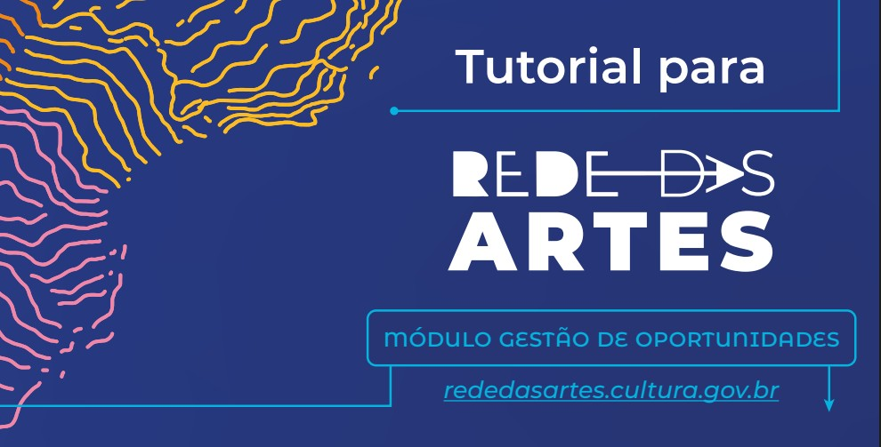

## 1. Introdução ao Módulo Gestor

O **Módulo Gestor** da Rede das Artes é uma ferramenta desenvolvida especificamente para gestores culturais, administradores e coordenadores de políticas públicas que necessitam de funcionalidades avançadas de gestão e controle da plataforma.

Este módulo oferece recursos administrativos que permitem gerenciar de forma eficiente agentes, oportunidades, projetos, espaços e eventos, além de fornecer relatórios detalhados e métricas para tomada de decisão estratégica.

---

### 1.1. O que é o Módulo Gestor?

O Módulo Gestor é uma extensão da plataforma Rede das Artes que fornece ferramentas administrativas para:

- **Gestão centralizada** de conteúdos e usuários
- **Moderação** de inscrições e cadastros
- **Análise de dados** e geração de relatórios
- **Configuração** de parâmetros da plataforma
- **Acompanhamento** de políticas públicas implementadas

---

### 1.2. Perfis de Acesso

O módulo oferece diferentes níveis de acesso conforme o perfil do gestor:

#### 1.2.1. Gestor Regional
- Gerencia agentes e eventos de sua região específica
- Acesso a relatórios regionais
- Moderação de conteúdos locais

#### 1.2.2. Gestor Estadual  
- Visão consolidada do estado
- Gestão de políticas estaduais
- Coordenação entre regiões

#### 1.2.3. Gestor Nacional
- Acesso completo à plataforma
- Gestão de políticas nacionais
- Configurações globais do sistema

---

### 1.3. Benefícios do Módulo

- **Eficiência administrativa**: Automatização de processos de gestão
- **Transparência**: Acompanhamento detalhado de ações e recursos
- **Tomada de decisão**: Relatórios e métricas em tempo real  
- **Articulação territorial**: Visão integrada das ações culturais
- **Controle de qualidade**: Ferramentas de moderação e validação

> Este manual apresenta todas as funcionalidades disponíveis para gestores, com exemplos práticos e orientações passo a passo para utilização eficiente da plataforma.
