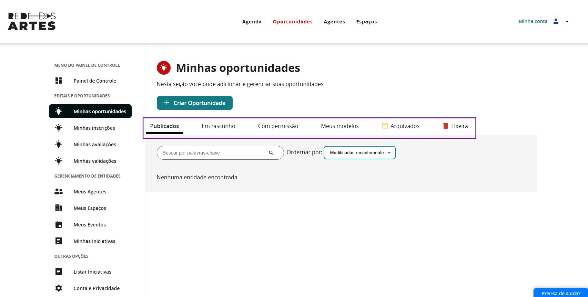
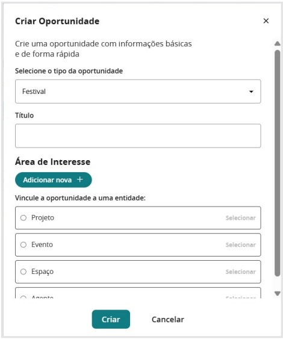
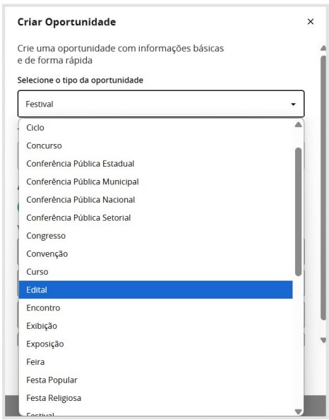
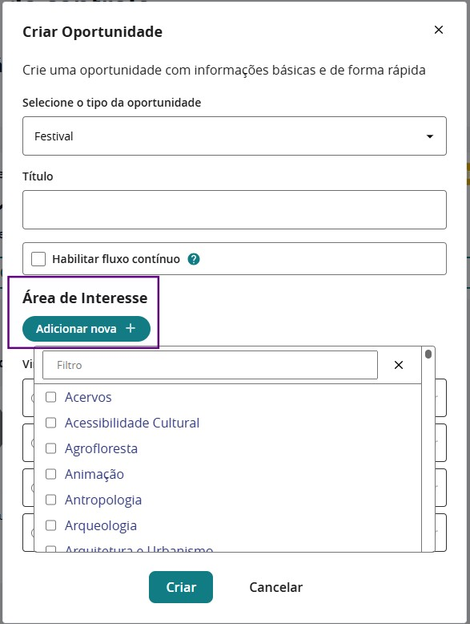
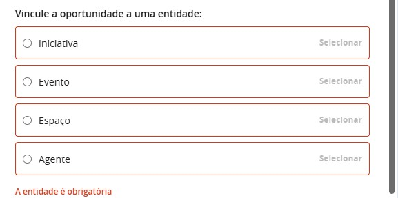
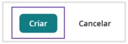
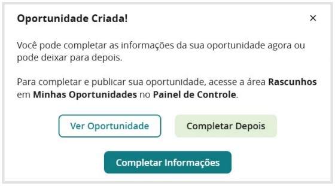

## Painel de Controle

O **Painel de Controle** é o centro de comando do Módulo Gestor, oferecendo uma visão consolidada de todas as atividades da plataforma e acesso rápido às principais funcionalidades administrativas.

## 🖥️ Visão Geral

A primeira informação importante é compreender as **informações disponíveis no Painel de Controle** da plataforma: 

Aqui você verá em destaque em verde o **“+ criar oportunidade”** e, abaixo, abas com os itens:

- **publicados**
- **em rascunho**
- **com permissão**
- **meus modelos**
- **arquivados**
- **lixeira**

Ao clicar no item:

Você inicia a construção de uma oportunidade, que pode ser uma chamada pública ou outra oportunidade.  
Nesse momento surge um **“pop-up”** com as seguintes informações para preenchimento:

A primeira ação necessária é definir o **tipo de oportunidade** que você irá criar.  
Há muitas opções disponíveis para criar uma oportunidade na plataforma:

---

## Áreas de Interesse

A seção de **Áreas de Interesse** permite categorizar a oportunidade dentro do universo cultural, facilitando a busca e identificação por agentes que atuam em determinados setores.

### Por que definir a área de interesse?

- Direciona a oportunidade para o público-alvo correto.  
- Melhora a indexação nas buscas dentro da plataforma.  
- Facilita a conexão entre agentes artísticos e editais específicos para suas áreas de atuação.

### Como preencher?

Na área de interesse, ao clicar no ícone **“adicionar nova”**, você acessa a lista de opções disponíveis.

Selecione uma ou mais áreas de interesse que representem o escopo da chamada pública.

A definição correta da área de interesse aumenta a relevância da oportunidade dentro da Plataforma, garantindo que ela seja encontrada por agentes artísticos alinhados à sua proposta.

## Entidade Vinculada

A **Entidade Vinculada** é a organização ou instituição responsável pela realização da oportunidade.

Esse campo permite associar a chamada pública a um **Projeto**, **Evento**, **Espaço** ou **Agente**.  
Lembre-se de que o agente pode ser individual ou coletivo.

### Como preencher?

- Busque o nome do **Iniciativa**, **Evento**, **Espaço** ou **Agente** na plataforma e vincule à oportunidade.  
- Caso a entidade ainda não esteja cadastrada, é importante cadastrá-la antes de adicionar a oportunidade.

A correta vinculação da entidade fortalece a confiabilidade da chamada pública, permitindo que os interessados identifiquem rapidamente quem está promovendo a oportunidade e como podem entrar em contato para obter mais informações.

Depois de preencher todas as informações da oportunidade, basta clicar em:

E você receberá a seguinte mensagem:

---

### 2.1. Filtros e Buscas Avançadas

O painel oferece ferramentas de filtragem por:

- **Território**: região, estado, município
- **Período**: datas específicas ou intervalos
- **Status**: ativo, pendente, encerrado
- **Categoria**: linguagem artística, tipo de agente
- **Tags**: palavras-chave personalizadas

---

### 2.4. Notificações e Alertas

Sistema integrado de notificações para:

- **Prazos próximos** de oportunidades
- **Novos cadastros** aguardando validação  
- **Eventos importantes** programados
- **Metas** de políticas públicas
- **Anomalias** no sistema

> O Painel de Controle é customizável conforme o perfil e necessidades específicas de cada gestor, permitindo priorizar as informações mais relevantes para sua área de atuação.
