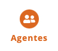

# Agentes

A aba **Agentes** no Mapas é um espaço fundamental para identificar, conectar e dar visibilidade a indivíduos e coletivos que atuam na cultura. Por meio dessa funcionalidade, artistas, produtores, gestores, pesquisadores, grupos e organizações podem criar seus perfis, fornecendo informações detalhadas sobre suas áreas de atuação, projetos, eventos e espaços culturais com os quais estão vinculados.

Cada agente pode cadastrar **biografia**, **contatos**, **redes sociais** e **experiências**, além de associar sua atuação a eventos, projetos e espaços já existentes na plataforma. Isso possibilita **fortalecer redes de colaboração**, ampliando a interação entre agentes culturais e incentivando parcerias.

A aba Agentes também facilita a **busca por profissionais da cultura**, promovendo a articulação entre criadores, instituições e gestores, tornando-se um recurso essencial para o fomento e a difusão da produção cultural nos territórios.

---

## 1. Quais perfis disponíveis no Mapa

No Mapas, os usuários podem criar perfis dentro de duas categorias principais de agentes culturais: **Agente Individual** e **Agente Coletivo**. Cada um desses perfis atende a diferentes formas de atuação na plataforma, permitindo a identificação, visibilidade e conexão entre artistas, grupos e iniciativas culturais.

### 1.1. Agente Individual

O perfil de Agente Individual é destinado a artistas, produtores, técnicos, pesquisadores e demais profissionais da cultura. Nesse perfil, o usuário pode cadastrar informações como:

- Biografia  
- Contatos  
- Áreas de atuação  
- Redes sociais  
- Vinculação com projetos, eventos e espaços culturais  

Essa opção permite maior **visibilidade do trabalho artístico**, funcionando como um **portfólio do agente**, e facilita a conexão com oportunidades, parcerias e editais disponíveis na plataforma.

### 1.2. Agente Coletivo

O perfil de Agente Coletivo é voltado para **grupos, companhias, bandas, coletivos artísticos e culturais**, com ou sem CNPJ, ou até mesmo empresas.

Esse cadastro permite reunir, em um único perfil, informações sobre o grupo. A criação do Agente Coletivo:

- Cria o portfólio do grupo  
- Permite a associação com eventos, espaços e projetos desenvolvidos pelo grupo  
- Fortalece a identidade do coletivo e amplia sua participação na rede cultural

> Ao criar um perfil, o usuário deve escolher qual tipo de agente melhor representa sua atuação. Ambos os tipos podem ser editados e atualizados a qualquer momento.

---

## 2. Visualização dos Agentes na Plataforma

No Mapas, os agentes podem ser visualizados de três maneiras diferentes, permitindo uma navegação mais intuitiva:

- Lista: Exibe os agentes em formato de cards, destacando informações essenciais, como nome, foto e área de atuação.
- Mapa: Permite visualizar os agentes georreferenciados, facilitando a identificação por localização e conexão com territórios.
- Tabela: Organiza os agentes em um formato estruturado, ideal para consultas rápidas e comparações de dados.

Abaixo, apresentamos capturas de tela (prints) de cada uma dessas visualizações para ilustrar melhor suas funcionalidades. 

1ª por lista:

2ª pelo Mapa:
O mapa interativo é a funcionalidade de encontrar as informações georreferenciadas na plataforma. Ele permite visualizar os registros georreferenciados de agentes culturais, eventos e espaços. 

Os usuários podem navegar pelo mapa utilizando zoom, arrastando a tela e clicando nos ícones representativos para obter mais informações sobre cada ponto mapeado. Ao clicar no pin do Agente, você tem mais informações:

3ª por tabela:
A terceira opção de visualização dos agentes no Mapas é o modo tabela, disponível em algumas versões. Essa opção organiza as informações de forma estruturada e facilita a consulta detalhada dos dados.Nesta visualização, os usuários podem:
Utilizar filtros para refinar a pesquisa de agentes, selecionando critérios como área de atuação, localização e tipo de agente (individual ou coletivo).
Consultar informações rapidamente, organizadas em colunas, permitindo uma análise comparativa entre diferentes agentes culturais.
Exportar os dados em diferentes formatos, possibilitando que sejam utilizados para planejamento, gestão e análise cultural.

No ícone  presente na primeira coluna você pode configurar quais colunas serão exibidas na lista.

---

## 3. Crie seu Portfólio (Gerencie o seu Perfil de Agente)

Após cadastrar sua conta como agente cultural (que você já aprendeu no item Home) é importante preencher o seu perfil detalhado com biografia, contatos e redes sociais. Os usuários podem editar e atualizar suas informações sempre que necessário, garantindo que seu perfil esteja atualizado e completo.

> Preenchimento, atualização e edição do perfil

Após criar a sua conta, você precisa completar o seu perfil adicionando informações como:

- Nome e descrição  
- Contato e redes sociais  
- Área de atuação e categorias culturais  
- Foto de perfil e imagens representativas  

Esses dados funcionam como um **portfólio digital**, aumentando a visibilidade do agente na plataforma e facilitando conexões com outros agentes culturais.

Para editar seu perfil:

1. Clique no canto superior direito no ícone do seu usuário  
2. Acesse o **Painel de Controle**  
3. Clique em sua página de agente  
4. Clique em **"Editar agente"**

> Exemplo de perfil preenchido pode ser incluído com prints de tela da plataforma.

---

## 4. Agentes e Oportunidades

Agentes culturais podem acessar **editais, cadastros, chamamentos e financiamentos** disponíveis na plataforma.

A ferramenta permite:

- Buscar oportunidades por filtros  
- Acompanhar inscrições  
- Encontrar fomento para suas ações culturais  

Além disso, **agentes também podem criar oportunidades**, como uma chamada para atuação em seus próprios projetos.

> A criação de oportunidades por agentes será detalhada posteriormente no item correspondente.
