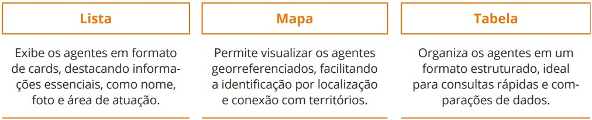
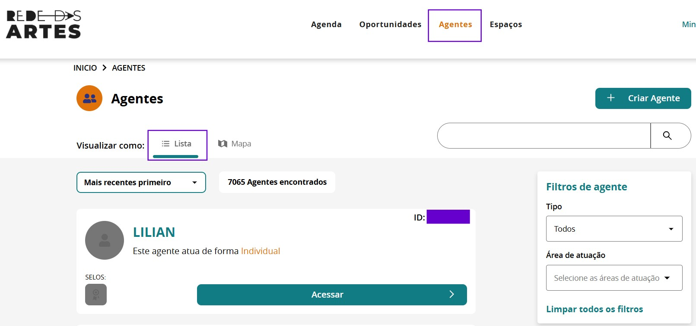
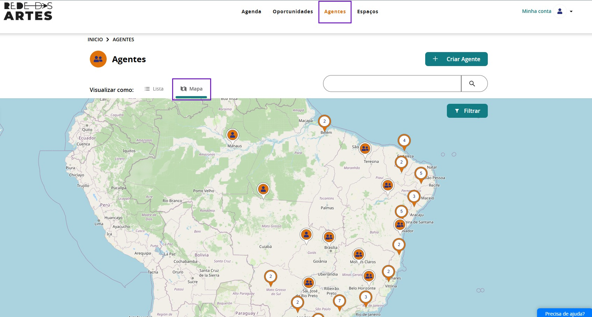
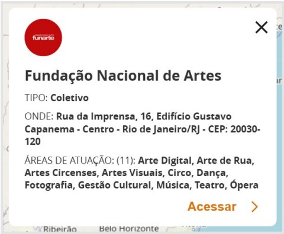

### 4. Agentes

A aba **Agentes** é um espaço fundamental para identificar, conectar e dar visibilidade a indivíduos e coletivos que atuam nos campos artísticos.  

Por meio dessa funcionalidade, artistas, produtores, gestores, pesquisadores, grupos e organizações podem criar seus perfis, fornecendo informações detalhadas sobre suas áreas de atuação, projetos, eventos e espaços artísticos com os quais estão vinculados.  

Cada agente pode cadastrar biografia, contatos, redes sociais e experiências, além de associar sua atuação a eventos, projetos e espaços já existentes na plataforma. Isso possibilita fortalecer redes de colaboração, ampliando a interação entre agentes artísticos e incentivando parcerias.  

A aba **Agentes** também facilita a busca por profissionais da cultura, promovendo a articulação entre criadores, instituições e gestores, tornando-se um recurso essencial para o fomento e a difusão da produção cultural nos territórios.

---

#### 4.1. Quais perfis estão disponíveis na plataforma

Na **Rede das Artes**, os usuários podem criar perfis dentro de duas categorias principais de agentes artísticos: **Agente Individual** e **Agente Coletivo**.  

Cada um desses perfis atende a diferentes formas de atuação na plataforma, permitindo a identificação, visibilidade e conexão entre artistas, grupos e iniciativas artísticas.

---

##### 4.1.1. Agente Individual

O perfil de **Agente Individual** é destinado a artistas, produtores, técnicos, pesquisadores e demais profissionais das artes.  

Nesse perfil, o usuário pode cadastrar informações como:  
- Biografia  
- Contatos  
- Áreas de atuação  
- Redes sociais  
- Vinculação com projetos, eventos e espaços artísticos  

Essa opção permite maior visibilidade do trabalho artístico, podendo ser utilizado como **Portfólio do agente**, e facilita a conexão com oportunidades, parcerias e editais disponíveis na plataforma.

---

##### 4.1.2. Agente Coletivo

O perfil de **Agente Coletivo** é voltado para grupos, companhias, bandas e coletivos artísticos que trabalham de forma colaborativa, com ou sem CNPJ, ou para empresas.  

Esse cadastro permite reunir, em um único perfil, informações sobre o grupo. A criação do **Agente Coletivo** possibilita a criação do portfólio do grupo e a associação a eventos, espaços e projetos desenvolvidos pelo grupo.  

Ao criar um perfil, o usuário deve escolher qual tipo de agente melhor representa sua atuação. Ambas as categorias podem ser editadas e atualizadas a qualquer momento, garantindo que as informações estejam atualizadas.

---

#### 4.2. Visualização dos Agentes na Plataforma

Na **Rede das Artes**, os agentes podem ser visualizados de três maneiras diferentes:

Abaixo, apresentamos capturas de tela (**prints**) de cada uma dessas visualizações para ilustrar melhor suas funcionalidades.  

---

**1ª — Visualização por Lista**

---

**2ª — Visualização pelo Mapa**  

O **mapa interativo** é a funcionalidade de encontrar informações georreferenciadas na plataforma. Ele permite visualizar os registros georreferenciados de agentes artísticos, eventos e espaços.  

Os usuários podem navegar pelo mapa utilizando **zoom**, arrastando a tela e clicando nos ícones representativos para obter mais informações sobre cada ponto mapeado.  

Ao clicar no pin do Agente, você tem mais informações:

---

**3ª — Visualização por Tabela**  

A terceira opção de visualização dos agentes é o **modo tabela**, disponível em algumas versões.  

Essa opção organiza as informações de forma estruturada e facilita a consulta detalhada dos dados. Nesta visualização, os usuários podem:  

- Utilizar filtros para refinar a pesquisa de agentes, selecionando critérios como **área de atuação**, **localização** e **tipo de agente** (individual ou coletivo).  
- Consultar informações rapidamente, organizadas em colunas, permitindo uma análise comparativa entre diferentes agentes artísticos.  
- Exportar os dados em diferentes formatos, possibilitando que sejam utilizados para **planejamento, gestão e análise cultural**.

---

#### 4.3. Crie seu Portfólio (Gerencie o seu Perfil de Agente)

Após cadastrar sua conta como agente (conforme explicado no item **Home**), é importante preencher o seu perfil detalhado com **biografia, contatos e redes sociais**.  

Os usuários podem editar e atualizar suas informações sempre que necessário, garantindo que o perfil esteja **atualizado e completo**.

**Preenchimento, atualização e edição do perfil**  

Após criar a sua conta, você precisa completar o seu perfil adicionando informações como:  

- Nome e descrição  
- Contato e redes sociais  
- Área de atuação e categorias artísticas  
- Foto de perfil e imagens representativas  

Esses dados são fundamentais para aumentar a visibilidade do usuário na plataforma, funcionando também como um **Portfólio Digital** de sua trajetória, facilitando conexões com outros agentes artísticos.  

Para editar seu usuário:  
1. Clique em **Minha Conta** no canto superior direito.  
2. No painel de controle, clique em **Meu Perfil**.  
3. Na página de agente, clique em **Editar Agente**.

---

#### 4.4. Agentes e Oportunidades

Os agentes artísticos podem acessar, por meio da plataforma, **editais, consultas públicas, cadastros, chamamentos e oportunidades de fomento**, utilizando filtros que facilitam a busca por ações específicas alinhadas aos seus interesses.  

O processo de inscrição em oportunidades já foi apresentado anteriormente neste tutorial, no item **Oportunidades**, com o detalhamento do passo a passo de como se inscrever em seleções abertas.  

Além disso, a plataforma permite que agentes artísticos criem suas próprias oportunidades, como:  
- Convocatórias para atuação em projetos  
- Chamadas internas  
- Processos seletivos  

Essa funcionalidade, voltada à gestão de oportunidades, será apresentada em detalhes no **Módulo Gestor**, que aborda as etapas de criação, configuração e acompanhamento de oportunidades na plataforma.

> A criação de oportunidades por agentes será detalhada posteriormente no item correspondente.
