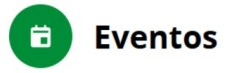
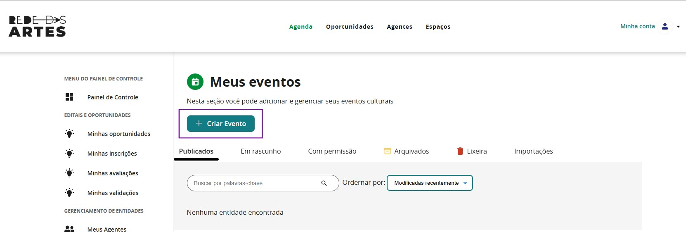

# Eventos

A aba Eventos no Mapas é um espaço dedicado à divulgação e gestão de atividades culturais, permitindo que agentes, coletivos e instituições cadastrem e compartilhem eventos de forma acessível e integrada. Nessa seção, é possível registrar informações detalhadas, como nome, descrição, datas, horários, local e classificação etária, além de vincular os eventos a espaços, projetos e agentes já cadastrados na plataforma.

## 1. Definição e objetivos dos eventos na plataforma

O principal objetivo dessa funcionalidade é ampliar a visibilidade dos eventos, conectar agentes e público e facilitar o acesso às atividades culturais em diferentes territórios. Além disso, os eventos cadastrados podem ser associados a espaços, projetos e agentes, permitindo uma maior integração e organização das programações culturais.

### 1.1. O que são os circuitos?

Na aba Eventos, é possível criar Circuitos Culturais como eventos compostos por ocorrências múltiplas, como apresentações, sessões ou atividades distribuídas ao longo do tempo ou em diferentes locais. Essa funcionalidade facilita a organização de festivais, mostras e programações contínuas, permitindo que os usuários registrem a diversidade de ações sob uma mesma proposta curatorial.

### 1.2. O que são as ocorrências?

As ocorrências no Mapas são registros que permitem definir datas, horários e locais específicos dentro de um evento. Essa funcionalidade é útil para eventos que ocorrem em múltiplos dias, horários e locais, como festivais, temporadas de espetáculos ou atividades itinerantes.  
Cada evento pode ter uma ou várias ocorrências, facilitando a organização e a comunicação da programação. Por exemplo, um espetáculo teatral que acontece todas as sextas-feiras em um mês pode ter ocorrências separadas para cada apresentação, sem a necessidade de criar eventos distintos.  
Ao cadastrar ocorrências, os organizadores garantem que o público tenha informações detalhadas e atualizadas sobre cada sessão ou edição do evento, otimizando a experiência e o planejamento dos participantes.

### 1.3. Como Criar um Evento/Circuito?

Criar um evento no Mapas é um processo simples e intuitivo. Para isso, siga os passos abaixo:

**Passo 1️:**  
Acesse seu perfil na plataforma e clique na aba "Eventos".

**Passo 2️:**  
Clique no botão "Criar Evento" e preencha as informações básicas, como nome, descrição, categoria e classificação indicativa.

**Passo 3️:**  
Ao clicar em “Complementar Informações”, você terá acesso a campos específicos para adicionar mais detalhes sobre o seu evento, enriquecendo sua apresentação na plataforma. Nessa etapa, é possível ajustar ou atualizar as informações iniciais, como título, descrição e tipo de evento, além de inserir um link para a página oficial do projeto, caso exista. Observe que na seção lateral há a possibilidade de adicionar as informações de redes sociais também.

**Passo 4:**  
Na seção “Data, hora e local do evento”, é o momento de clicar em “Inserir nova ocorrência” para cadastrar as datas, horários e locais de cada atividade que compõe o seu Circuito. Cada ocorrência representa uma parte da programação, como uma sessão, apresentação ou ação específica. Esse recurso é essencial para estruturar eventos com múltiplas datas ou locais, como festivais, mostras e turnês, garantindo clareza e organização na visualização do circuito pelo público.

**Passo 5:**  
Preencha as demais seções — de informações sobre o evento, de acessibilidade e de informações públicas do evento.

**Passo 6:**  
Revise todas as informações e clique em "Salvar" para publicar o evento. Assim, o evento ficará disponível para pesquisa e acesso online, facilitando a organização, promoção e visibilidade das atividades culturais, tornando-as acessíveis a um público maior.
