## 2.1 Navegação básica

A **Home** da Rede das Artes é a porta de entrada para a plataforma, reunindo as principais informações e acessos rápidos para navegação. Nela, os usuários encontram um panorama atualizado da rede, com destaques de eventos, oportunidades, espaços e agentes artísticos cadastrados.

No topo da página, está disponível um **menu de navegação**, permitindo acesso direto às principais seções da plataforma, como:

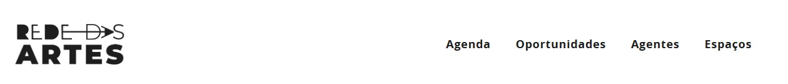

Além disso, a Home pode apresentar **destaques editoriais**, como chamadas para editais abertos, eventos em evidência e novidades do setor cultural.  

A interface é projetada para ser **dinâmica e acessível**, garantindo que gestores, artistas e coletivos possam interagir facilmente com a plataforma e encontrar o que precisam com rapidez.

A partir da Home, qualquer usuário pode explorar o vasto ecossistema cultural mapeado na plataforma, seja para:

- Descobrir novas oportunidades
- Conectar-se com outros agentes
- Acompanhar atividades e iniciativas em seu território

> Utilizamos, para as capturas de tela, a versão implementada para a **Rede das Artes**, como exemplo de customização do Mapas, conforme a política cultural implementada.

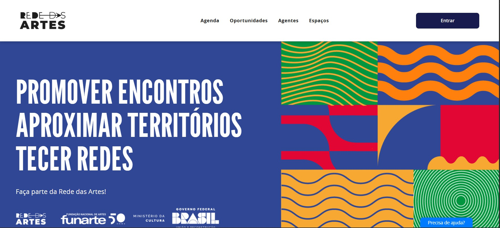

Na Rede das Artes, os usuários encontram uma ampla gama de informações, que estão organizadas pelas seguintes abas:

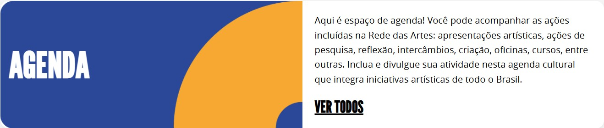

- **Agenda:** Ambiente para o cadastro e divulgação de eventos culturais, contendo datas, horários, locais, descrições e associações a agentes, projetos e espaços culturais, possibilitando a organização de festivais, mostras e programações contínuas.

- **Oportunidades:** Seção dedicada à criação, divulgação e gestão de editais, chamadas públicas, premiações e incentivos culturais. Permite que agentes publiquem oportunidades e acompanhem inscrições, enquanto agentes culturais podem buscar, filtrar e se inscrever em processos seletivos diretamente na plataforma.

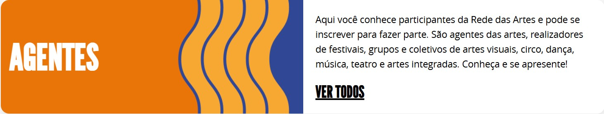

- **Agentes:** Espaço onde artistas, coletivos e profissionais da cultura podem cadastrar suas informações, incluindo áreas de atuação, histórico, contatos e vínculos com projetos, espaços e eventos, facilitando conexões e colaborações.

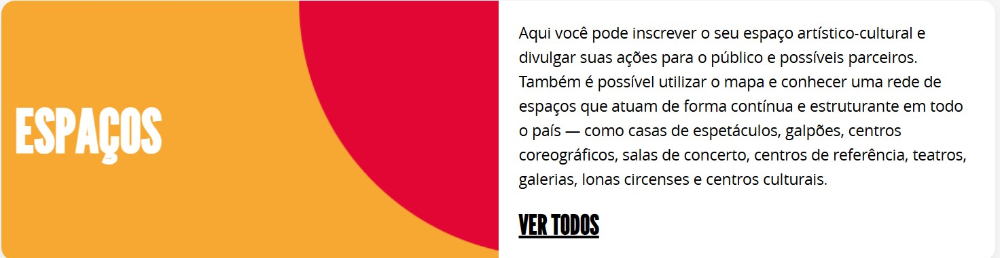

- **Espaços:** Seção destinada ao mapeamento e registro de locais de referência cultural, como teatros, museus, centros comunitários, bibliotecas e espaços autônomos, com informações sobre funcionamento, infraestrutura e atividades realizadas.

Essa diversidade de informações permite que a plataforma seja uma ferramenta estratégica tanto para a comunidade cultural quanto para gestores públicos na formulação de políticas e ações culturais.

---

## 2.2 Como criar uma conta?

Para acessar todas as funcionalidades da Rede das artes, é necessário criar uma conta. O processo é simples e requer apenas um endereço de e-mail válido e a criação de uma senha. Segue
passo a passo para a criação de um usuário:

1. Clique em **Entrar**.

2. Insira o seu e-mail ou CPF que a Rede das Artes faz uma busca para verificar se você já
possui uma conta:

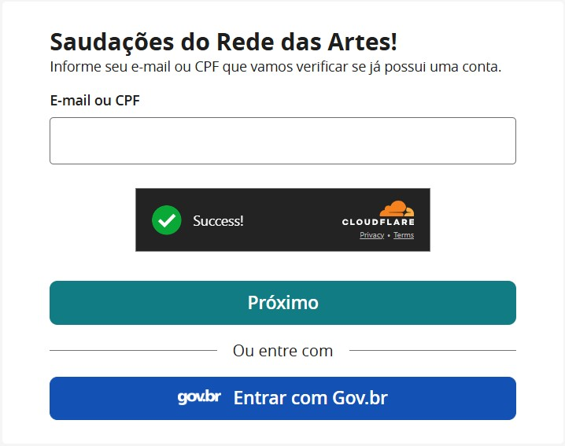

3. A Rede das Artes reporta que você não tem conta e te encaminha para a página de criar conta:

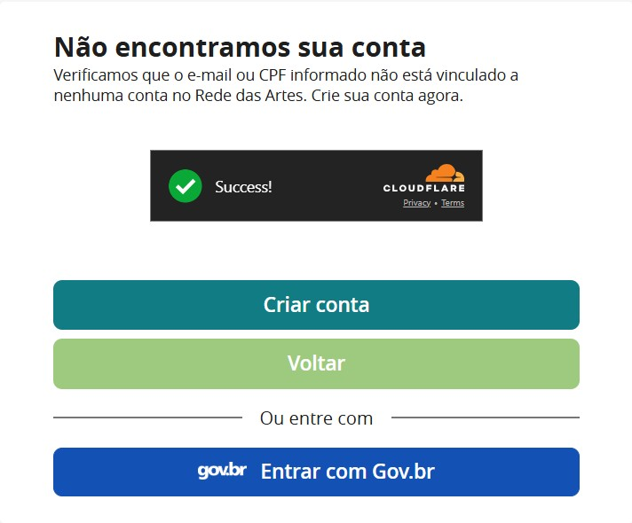

4. Clique em criar conta e você será redirecionado para a seguinte página:

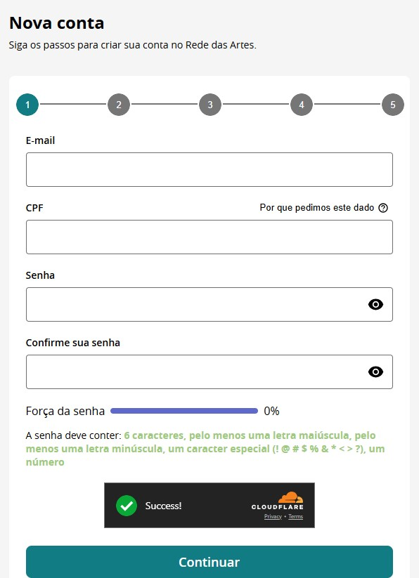

5. Preencha as informações solicitadas e clique em continuar. 

6. Você será direcionado para a próxima página. Preencha com o seu nome e a sua mini
biografia:

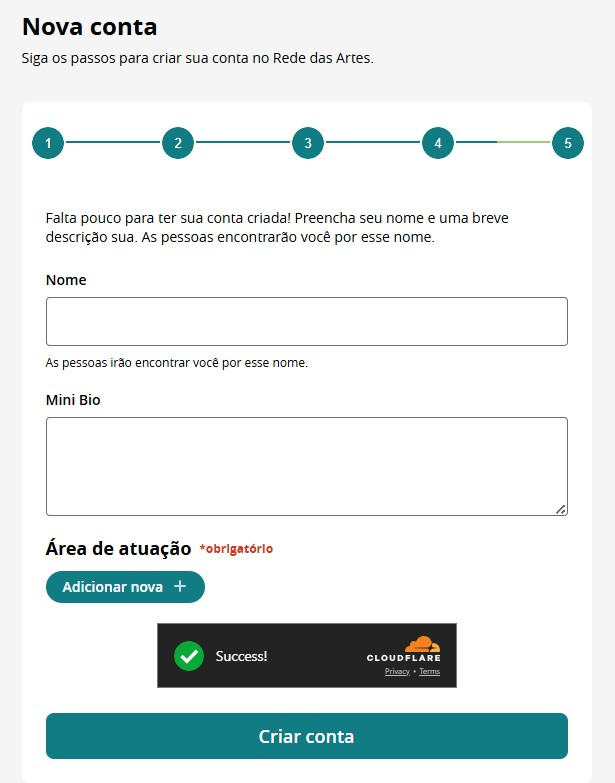

7. Após preencher as informações, é só clicar em “criar conta”.

---

## 2.3 Edição e Atualização de Informações

A plataforma permite que usuários editem e atualizem seus **projetos**, **espaços** e **eventos** a qualquer momento pelo **Painel de Controle**, garantindo que as informações estejam sempre acessíveis e relevantes para a comunidade cultural.

Manter os dados atualizados no Mapas é essencial para **ampliar a visibilidade** das iniciativas, **facilitar conexões** e assegurar que o público e os gestores culturais tenham acesso a informações corretas.

> Dica: Edite seu perfil sempre que quiser corrigir detalhes, adicionar novas informações ou ajustar datas e descrições.

---

## 2.4 Meu Painel de Controle

Para acessar o painel de controle, você deve clicar no menu superior, no canto direito da tela, no ícone **"Minha Conta"**.

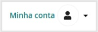

Ao acessá-lo, você será direcionado ao painel de controle, onde pode gerenciar de forma rápida e prática todas as informações relacionadas ao seu perfil na plataforma. Esse espaço permite a edição e atualização dos seus dados.  

Nele você pode:

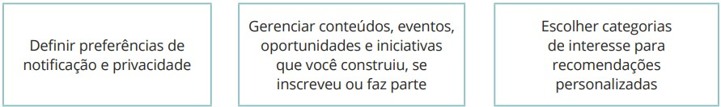

A personalização do perfil e das preferências permite uma experiência mais eficiente e alinhada às necessidades de cada usuário.  

Assim que você clica em **"Minha Conta"**, aparecem os atalhos do painel de controle.  

Dessa forma:

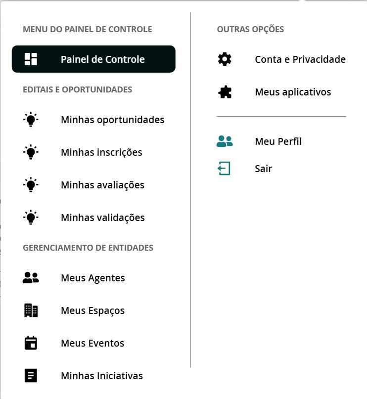

Ao clicar no **Painel de Controle**, você será direcionada(o) para a página com o resumo de suas inscrições, eventos, perfis e oportunidades criadas:

---

### 2.4.1 Conta e Privacidade

Nesta seção é possível:
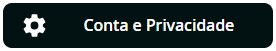

- Alterar informações de **e-mail e senha**;
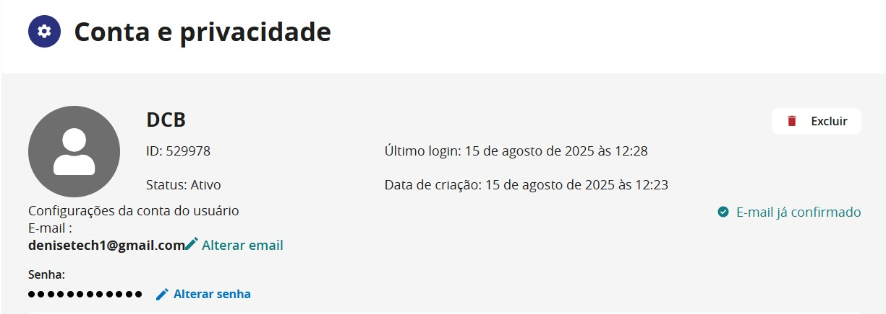

---

## 2.5 Utilizando filtros e buscas

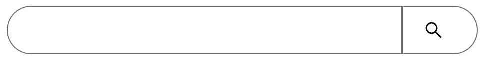

Para refinar a pesquisa, a plataforma disponibiliza filtros avançados. Os usuários podem buscar informações por categorias, localização geográfica, tipo de agente, data de eventos e palavras-chave.  

Isso facilita a localização de conteúdos específicos e a identificação de oportunidades artísticas relevantes.  

> O ícone está sempre na lateral direita dentro de cada aba disponibilizada no menu superior da **Rede das Artes**.

