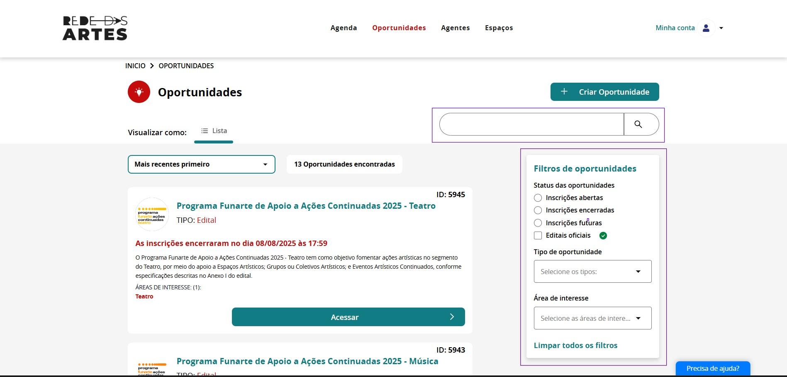
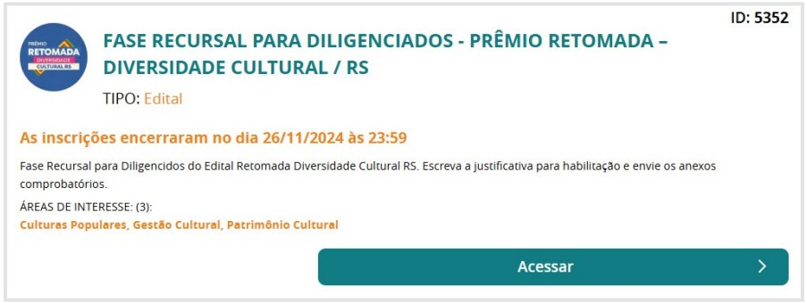
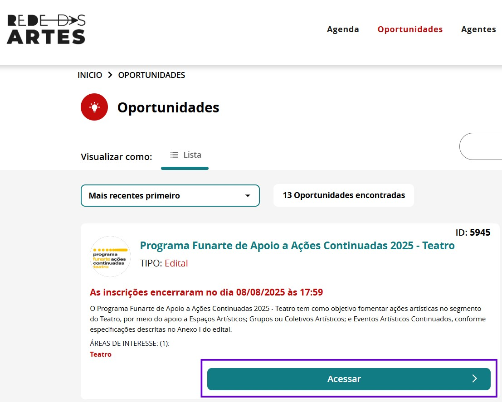
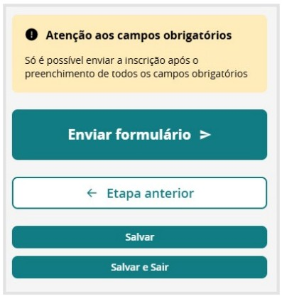
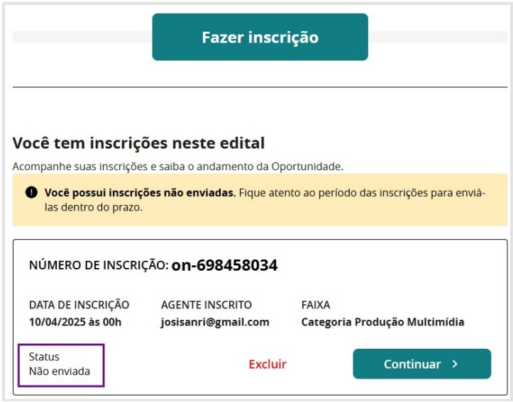

### 3. Oportunidades

A aba **Oportunidades** da Rede das Artes permite que agentes, gestores e instituições artístico-culturais criem, divulguem e gerenciem editais, chamadas públicas, premiações e outras formas de incentivo às artes diretamente na plataforma.  

Além disso, oferece aos agentes artísticos a possibilidade de acessar, visualizar e se inscrever em oportunidades disponíveis, acompanhando o status de suas inscrições em um ambiente unificado e transparente.  

Essa funcionalidade facilita tanto a gestão dos processos seletivos quanto a participação de artistas e coletivos, promovendo maior acessibilidade e democratização do acesso aos recursos públicos, fortalecendo a diversidade e o alcance das políticas culturais.

---

#### 3.1 Acessando Oportunidades Disponíveis

Ao acessar a aba **Oportunidades**, a página inicial exibe as últimas chamadas e oportunidades disponíveis, como no exemplo do Programa Rede das Artes, demonstrado abaixo.  

Esses conteúdos são exibidos diretamente na plataforma, facilitando o acesso às iniciativas mais recentes.  

Para encontrar oportunidades específicas, você pode utilizar a ferramenta de busca e aplicar filtros por área cultural, localidade, tipo de proponente ou período de inscrição, otimizando a navegação e localização das chamadas mais relevantes para o seu perfil:

As **Oportunidades** da plataforma vão além da criação de editais formais — elas também podem ser utilizadas para chamadas públicas diversas, como seleções de artistas, prestadores de serviço ou participantes de projetos artísticos.  

No exemplo abaixo, apresentamos uma pesquisa, demonstrando como a plataforma pode ser aplicada de forma flexível para diferentes tipos de oportunidades:

Como a funcionalidade específica para a solicitação de recursos está em desenvolvimento na plataforma — atualmente o recurso disponível envia a solicitação ao e-mail cadastrado para gestão da chamada pública —, alguns gestores têm adotado uma alternativa estratégica: criar a **fase recursal** como uma nova oportunidade.  

Essa prática atualmente evita a dispersão de informações em e-mails e planilhas paralelas, garantindo mais organização, rastreabilidade e transparência no processo, além de manter toda a tramitação documental centralizada na plataforma.  

**Exemplo de fase recursal como nova oportunidade:**

---

#### 3.2. Inscrição nas chamadas públicas

Para se inscrever em uma oportunidade na plataforma, o processo é simples e acessível.  

Primeiro, acesse a plataforma com seu login. Em seguida, clique na aba **"Oportunidades"** no menu principal e localize o edital desejado utilizando os filtros disponíveis.

**Passo 1 — Acessar a Oportunidade:**  

Ao encontrar a sua oportunidade, clique em **"Acessar"**:

**Passo 2 — Ler as Informações da chamada pública:**  

Antes de iniciar sua inscrição, é fundamental ler atentamente a descrição do edital, incluindo os critérios de participação, prazos e a documentação exigida.  

Essas informações garantem que sua candidatura esteja adequada às exigências da seleção. Em caso de dúvidas, consulte o **FAQ** disponível na própria página da oportunidade ou entre em contato com a equipe responsável pela gestão do edital por meio dos canais informados.

**Passo 3 — Iniciar a Inscrição:**  

Dentro da página da oportunidade, clique no botão **"Inscrever-se"** para iniciar sua candidatura.  

Você deverá preencher os campos obrigatórios do formulário, incluindo:  
- Dados do proponente (seja agente individual ou coletivo)  
- Informações detalhadas sobre a proposta  
- Upload dos documentos exigidos (PDFs, imagens e outros anexos solicitados)  

O sistema irá gerar automaticamente um número de inscrição, que servirá como referência para acompanhar o andamento da sua inscrição no processo seletivo:

**Passo 4 — Revisar e Enviar o Formulário:** 

Fique atento aos campos obrigatórios do formulário de inscrição: o envio só será permitido após o preenchimento completo dessas informações.  

Durante o processo, você pode utilizar os botões **"Salvar"** ou **"Salvar e Sair"** para registrar seu progresso e continuar depois, sem perder os dados inseridos.  

Se precisar revisar alguma etapa anterior, basta clicar em **"Etapa Anterior"**.  

Ao finalizar, clique em **"Enviar Formulário"** para concluir sua inscrição com sucesso.

**Passo 5 — Acompanhar a Situação da Inscrição:** 

A inscrição em rascunho estará na página da oportunidade, logo abaixo do ícone da inscrição:

Esse campo permite acompanhar o andamento da sua participação no processo seletivo. Nele são exibidos dados como:

- Número da inscrição  
- Data em que foi iniciada  
- Agente inscrito (individual ou coletivo)  
- Faixa ou categoria escolhida  
- Status atual da inscrição (ex.: "Não enviada")  

**Atenção ao status "Não enviada":** isso significa que a inscrição ainda não foi finalizada e não será considerada no processo seletivo se não for enviada dentro do prazo. Verifique e conclua o envio o quanto antes!  

Você também consegue acompanhar o andamento das suas inscrições pelo **Painel de Controle**, no item **"Minhas Oportunidades"**, visualizando o status atualizado de cada inscrição — como **Enviada**, **Em Análise**, **Aprovada** ou **Indeferida** —, além de conferir o número de inscrição gerado no momento do envio.

**Passo 6 — Acompanhar os resultados e recursos:**  

Por fim, fique atenta(o) aos prazos de avaliação e à divulgação dos resultados dos selecionados.  

Se a chamada pública prever uma fase de recursos, é fundamental seguir as orientações indicadas na oportunidade e realizar a contestação dentro do período estipulado, garantindo seu direito de revisão no processo seletivo.

