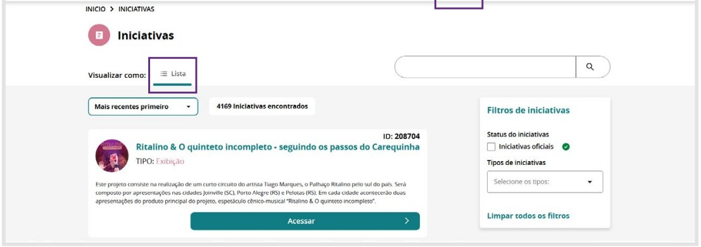

## 7. Iniciativas

A aba **Iniciativas** é um espaço dedicado ao **cadastro e à gestão de iniciativas artísticas**, permitindo que agentes, coletivos e instituições registrem e divulguem seus **projetos de forma estruturada**.

Nessa seção, é possível cadastrar **ações artísticas de curta ou longa duração**, como:

- Festivais  
- Programas de formação  
- Pesquisas  
- Iniciativas comunitárias  
- Produções audiovisuais, entre outros

Cada Iniciativa pode conter **informações detalhadas**, incluindo:

- Descrição  
- Objetivos  
- Equipe envolvida  
- Territórios de atuação  
- Cronograma  
- Parcerias

Além disso, é possível **associar projetos a agentes artísticos, espaços e eventos cadastrados**, ampliando a conexão entre as iniciativas e **fortalecendo redes de colaboração**.

Com essa funcionalidade, a plataforma não apenas permite a **sistematização e o acompanhamento de projetos artísticos**, mas também:

- Facilita o acesso a **oportunidades de fomento, editais e parcerias**
- Contribui para o **fortalecimento da produção cultural**  
- Valoriza a **diversidade artística** em todo o país.

