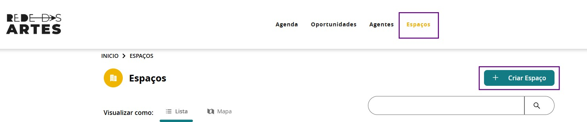
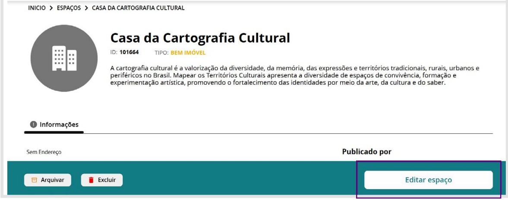
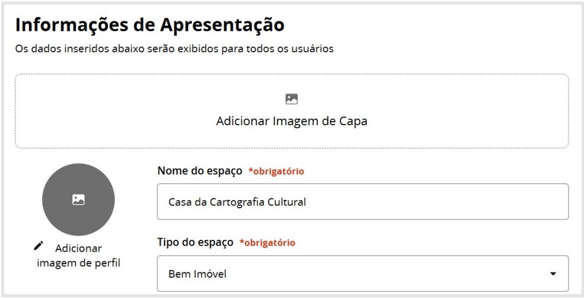

# Espaços

A aba Espaços no Mapas é um ambiente dedicado ao cadastro, mapeamento e gestão de equipamentos culturais. Nessa seção, agentes e instituições podem registrar teatros, centros culturais, museus, bibliotecas, salas de cinema, casas de espetáculo, quilombos, aldeias, terreiros, espaços autônomos, entre outros, proporcionando maior visibilidade e integração entre os diversos territórios. A aba Espaços consolida o Mapas como um instrumento essencial para a cartografia da cultura. Torna visível a riqueza, a diversidade e a presença viva das expressões diversas nos territórios.

Cada espaço cadastrado pode conter informações detalhadas, como endereço, descrição, capacidade, acessibilidade, fotos, vídeos, contato, programação e vínculo com eventos, agentes culturais e outras informações pertinentes sobre o local. Cadastre o seu Espaço no Mapas e contribua para a Cartografia da Cultura.

## 1. Como cadastrar Espaços

Cadastrar um espaço cultural no Mapas é o primeiro passo para integrá-lo à cartografia colaborativa da cultura brasileira. A partir da aba “Espaços”, o usuário insere informações essenciais como nome, tipo, área de atuação e uma descrição curta. Após a criação, recomenda-se complementar o cadastro, enriquecendo o perfil com dados que darão visibilidade pública ao espaço. Essa etapa permite tornar o espaço reconhecível na plataforma, conectando-o a territórios, agentes e iniciativas culturais. A seguir, detalhamos os blocos e campos disponíveis para completar esse processo.

**Passo 1 - Acesse a aba “Espaços” no Mapas:**

**Passo 2 - Preencha as informações primárias sobre o seu Espaço:**

**Passo 3 - Preencha o Nome, Tipo, Área de Atuação e a Descrição Curta do Espaço:**

**Passo 4 - Após preencher as suas informações, clique em “criar e publicar”:**

Nesse exemplo, construímos um Espaço fictício apenas para apresentar como é o campo preenchido.

**Passo 5 - O espaço foi criado! Nesse passo você poderá clicar em “Ver Espaço”, “Completar Informações” ou “Completar Depois”. Indicamos que clique em “Completar Informações”:**

**Passo 6 - Caso deixe para complementar os dados depois, você pode acessar o seu Espaço no Painel de Controle em Meus Espaços:**

ou indo direto no espaço e clicando em “Editar Espaço”:

## 2. Como complementar as informações do seu Espaço

Ao acessar a página para complementar informações do seu Espaço, você pode preencher as informações para dar visibilidade pública a um espaço cultural na plataforma. Os dados preenchidos aqui serão exibidos para todos os usuários e funcionam como o cartão de visita do espaço dentro do Mapas da Cultura.

A seguir, explicamos os principais blocos e campos disponíveis nesta tela:

### Informações de Apresentação - Imagem de Capa e Perfil

Nesta etapa, são exibidos os dados iniciais do espaço cultural, preenchidos no momento do cadastro. Esses dados compõem o perfil público resumido do espaço, funcionando como ponto de partida para sua visibilidade territorial na plataforma.  
A partir dessa base, você pode adicionar uma imagem de capa, que será exibida no topo da página do espaço, e uma imagem de perfil, que acompanhará os resultados de busca e os acessos rápidos ao cadastro.

### Endereço do Espaço

Preencher corretamente as informações de endereço do seu espaço cultural é fundamental para que ele seja georreferenciado na plataforma Mapas da Cultura. Isso permite que o espaço seja visualizado no mapa interativo, facilitando seu reconhecimento no território e fortalecendo sua articulação com iniciativas próximas.

### Acessibilidade e Acessibilidade Física

Informe se o seu espaço cultural é acessível e quais recursos de acessibilidade física estão disponíveis. Essa informação é essencial para garantir a inclusão de todas as pessoas, respeitando a diversidade de corpos, mobilidades e condições.

### ⏰ Capacidade e Horário de Funcionamento

Permite indicar a capacidade de atendimento do espaço e os dias e horários de funcionamento, fundamentais para usuários que desejam visitá-lo ou utilizá-lo para ações culturais.

### Contatos

Campos para inserir telefones e e-mails, facilitando o contato com os responsáveis pelo espaço.

### Mais Informações Públicas

Área voltada para o enriquecimento da narrativa do espaço. Permite adicionar descrições mais completas, arquivos para download, links, vídeos e imagens que contem sua história, trajetória, impacto no território e ações culturais realizadas.

## 3. Visualização dos Espaços

Os usuários podem acessar as informações sobre os espaços culturais cadastrados na plataforma de duas maneiras principais: **visualização em lista** e **visualização georreferenciada no mapa**. Cada formato oferece uma experiência distinta de navegação, conforme segue:

### 3.1. - Visualização em Lista

Nesta visualização, os espaços culturais são exibidos em formato de lista textual, que permite uma navegação simples e objetiva. Essa é a visualização padrão ao acessar a aba “Espaços”, e apresenta os cadastros de forma sequencial. Para visualizar todos os espaços disponíveis, basta rolar a página — os dados são carregados automaticamente conforme o usuário avança na navegação.

Para visualizar as informações dos Espaços basta clicar em “Acessar”:

### 3.1.2. - Para realizar pesquisas:

Para realizar pesquisas, utilize o campo de busca localizado logo abaixo do botão “+ Criar Espaço”, ou aplique os filtros disponíveis na lateral da página. Essas ferramentas permitem refinar a pesquisa por nome, localização, tipo de espaço e outros critérios, facilitando a localização de espaços culturais específicos.

### 3.2. - Visualização no Mapa

Exibe os espaços de forma georreferenciada, oferecendo uma visão territorial da distribuição cultural. É especialmente útil para identificar a presença de espaços culturais em determinadas regiões, bairros ou municípios.

Ao clicar no pin de localização, você tem mais informações sobre o espaço cultural.
