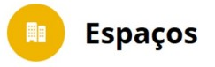
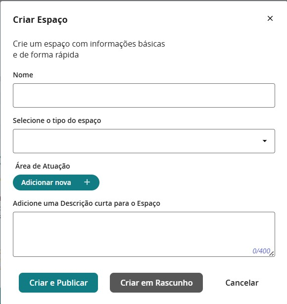
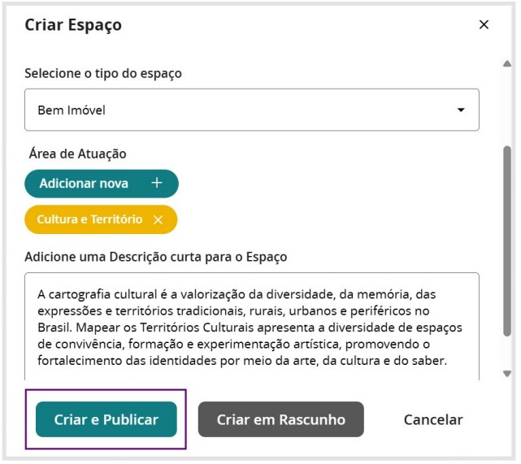
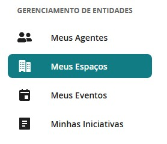
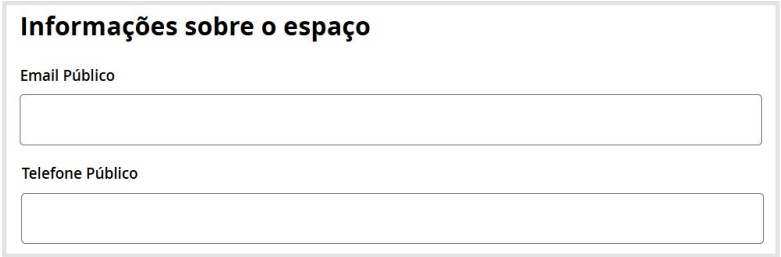
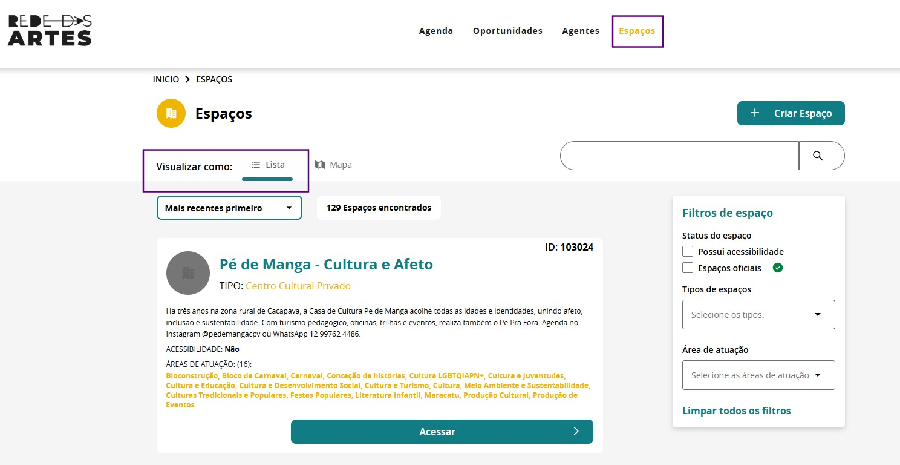
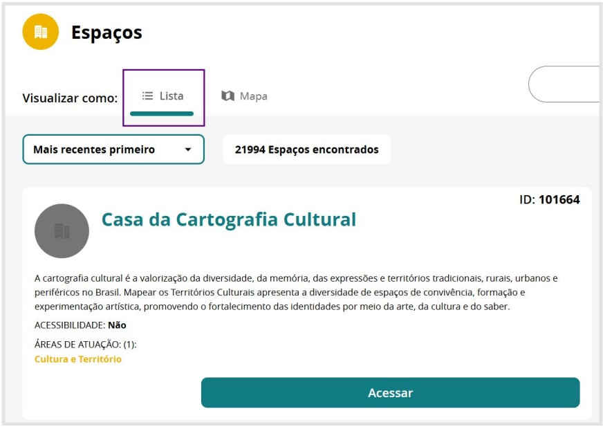
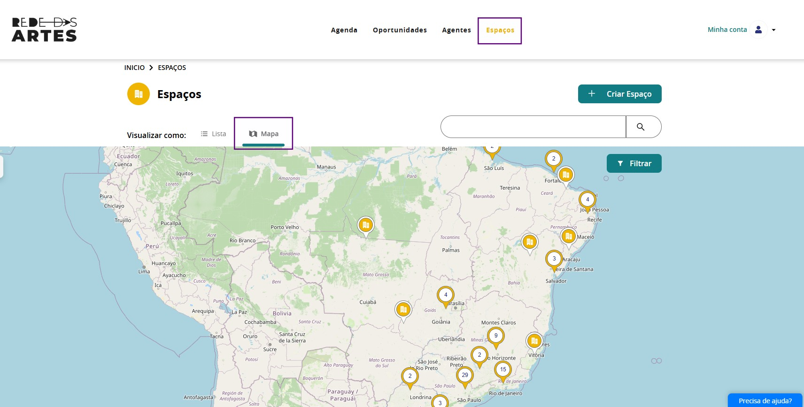
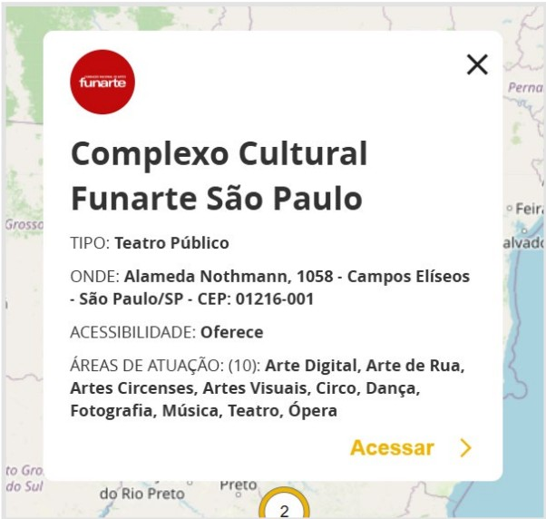

## 6. Espaços

A aba **Espaços** é um ambiente dedicado ao **cadastro, mapeamento e gestão de equipamentos artísticos**.  
Nessa seção, agentes e instituições podem registrar **teatros, centros culturais, museus, bibliotecas, salas de cinema, casas de espetáculo, quilombos, aldeias, terreiros, espaços autônomos**, entre outros, proporcionando maior visibilidade e integração entre os diversos territórios.

A aba Espaços consolida a **Rede das Artes** como um instrumento essencial para a **cartografia artística**.  
Torna visível a riqueza, a diversidade e a presença viva das expressões diversas nos territórios.

Cada espaço cadastrado pode conter informações detalhadas, como:

- Endereço  
- Descrição  
- Capacidade  
- Acessibilidade  
- Fotos  
- Vídeos  
- Contato  
- Programação  
- Vínculo com eventos, agentes culturais e outras informações pertinentes sobre o local

>**Cadastre o seu Espaço na Rede das Artes e contribua para a Cartografia das Artes.**

### 6.1. Como cadastrar Espaços

Cadastrar um espaço cultural é o primeiro passo para integrá-lo à **cartografia colaborativa das artes brasileiras**.  
A partir da aba **“Espaços”**, o usuário insere informações essenciais como:

- Nome  
- Tipo  
- Área de atuação  
- Descrição curta

Após a criação, recomenda-se **complementar o cadastro**, enriquecendo o perfil com dados que darão visibilidade pública ao espaço.  
Essa etapa permite tornar o espaço reconhecível na plataforma, conectando-o a **territórios, agentes e iniciativas artísticas**.

A seguir, detalhamos os blocos e campos disponíveis para completar esse processo.

**Passo 1:**

Acesse a aba **“Espaços”** na Rede das Artes:

**Passo 2:**  

Preencha as **informações primárias** sobre o seu Espaço.

**Passo 3:** 

Preencha o **Nome**, **Tipo**, **Área de Atuação** e a **Descrição Curta** do Espaço.

**Passo 4:** 

Após preencher as suas informações, clique em **“Criar e Publicar”**.

> Nesse exemplo, construímos um Espaço fictício apenas para apresentar como é o campo preenchido.

**Passo 5:**  

**O espaço foi criado!**

Nesse passo, você poderá clicar em **“Ver Espaço”**, **“Completar Informações”** ou **“Completar Depois”**. Indicamos que clique em **“Completar Informações”**.

**Passo 6:** 

Caso deixe para complementar os dados depois, você pode acessar o seu Espaço no **Painel de Controle** em **Meus Espaços**;

Ou indo direto no espaço e clicando em **“Editar Espaço”**:

---

### 6.2. Como complementar as informações do seu Espaço

Ao acessar a página para complementar informações do seu Espaço, você pode preencher os dados para **dar visibilidade pública** ao local na plataforma.  
Essas informações funcionam como o **cartão de visita** do espaço cultural.

A seguir, explicamos os principais blocos e campos disponíveis nesta tela:

#### **Informações de Apresentação - Imagem de Capa e Perfil**

Nesta etapa, são exibidos os dados iniciais preenchidos no momento do cadastro. Esses dados compõem o perfil público resumido do espaço.  

Você pode adicionar:

- **Imagem de capa**: exibida no topo da página do espaço.  
- **Imagem de perfil**: usada nos resultados de busca e acessos rápidos.

---

#### **Endereço do Espaço**

Preencher corretamente o endereço é fundamental para que o espaço seja **georreferenciado** na Rede das Artes. Isso permite a visualização no **mapa interativo**, facilitando o reconhecimento territorial e a articulação com iniciativas próximas.

---

#### **Acessibilidade e Acessibilidade Física**

Informe se o espaço é acessível e **quais recursos de acessibilidade física** estão disponíveis. Essa informação é essencial para garantir **inclusão e diversidade**, respeitando diferentes corpos, mobilidades e condições.

---

### ⏰ **Capacidade e Horário de Funcionamento**

Permite indicar:

- Capacidade de atendimento do espaço  
- Dias e horários de funcionamento

Essas informações são importantes para quem deseja visitar ou utilizar o espaço.

---

### **Contatos**

Campos para inserir:

- Telefones  
- E-mails  

Facilitando o contato com os responsáveis pelo espaço.

---

### **Mais Informações Públicas**

Área voltada ao **enriquecimento da narrativa do espaço**.  
Permite adicionar:

- Descrições mais completas  
- Arquivos para download  
- Links  
- Vídeos  
- Imagens  

Assim, podem contar a história, trajetória, impacto e ações artísticas realizadas.

---

## 6.3. Visualização dos Espaços

Os usuários podem acessar as informações sobre os espaços artísticos cadastrados na plataforma de duas maneiras principais: **visualização em lista** e **visualização georreferenciada no mapa**.  
Cada formato oferece uma experiência distinta de navegação, conforme segue:

### 6.3.1. Visualização em Lista

Nesta visualização, os espaços são exibidos em **formato de lista textual**, o que permite uma navegação **simples e objetiva**.  
Essa é a **visualização padrão** ao acessar a aba **“Espaços”**, e apresenta os cadastros de forma **sequencial**.

Para visualizar todos os espaços disponíveis, **basta rolar a página** — os dados são carregados automaticamente conforme o usuário avança na navegação.

Para visualizar informações detalhadas, clique em **“Acessar”**:

#### ***6.3.1.1. Para realizar pesquisas***

Para realizar pesquisas, utilize o **campo de busca** localizado logo abaixo do botão **“+ Criar Espaço”**,  
ou aplique os **filtros disponíveis na lateral da página**.

Essas ferramentas permitem **refinar a pesquisa** por:

- Nome  
- Localização  
- Tipo de espaço  
- Outros critérios

Facilitando assim a **localização de espaços artísticos específicos**.

### 6.3.2. Visualização no Mapa

Exibe os espaços de forma **georreferenciada**, oferecendo uma **visão territorial da distribuição cultural**.  
Essa visualização é especialmente útil para **identificar a presença de espaços artísticos** em determinadas **regiões, bairros ou municípios**.

Ao clicar no **pin de localização**, você tem **mais informações sobre o espaço cultural**:

